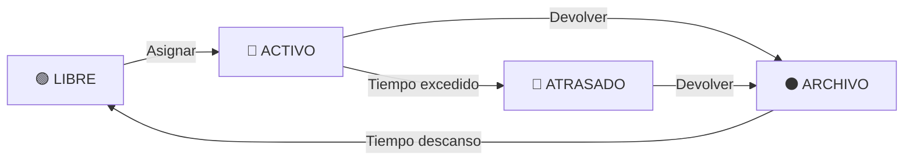

# 📘 Documentación de Funcionalidad – Sistema "Territorios"

## 🧩 Descripción General

La aplicación "Territorios" es una herramienta moderna de gestión de asignación de territorios para equipos de publicadores. Centraliza el control digital de quién tiene cada territorio, cuándo fue asignado, su estado actual, y facilita la comunicación rápida vía WhatsApp. El sistema reemplaza completamente la gestión manual tradicional en Excel y AppleScript, proporcionando una base de datos MySQL robusta con una interfaz web responsiva accesible desde cualquier dispositivo.

### 🎯 Objetivos del Sistema
- **Digitalización completa**: Eliminación de procesos manuales
- **Accesibilidad universal**: Funcionamiento óptimo en móviles y ordenadores
- **Comunicación eficiente**: Integración directa con WhatsApp
- **Gestión visual**: Estados claros y diseño intuitivo
- **Seguridad**: Control de accesos y validaciones

## 🗃️ Estructura del Sistema

### 📍 Arquitectura
- **Framework**: Laravel 11 con PHP 8.2+
- **Base de datos**: MySQL con migraciones y seeders
- **Frontend**: TailwindCSS para diseño responsivo
- **Imágenes**: 214 territorios con mapeo automático
- **Ubicación**: 
  - Local: `C:\xampp\htdocs\territorios` → `http://localhost/territorios/public/`
  - URL desarrollo: `http://127.0.0.1:8000`

## 📱 Módulos y Páginas Funcionales

### **Sistema de Títulos Estandarizado** ✅
Cada página tiene un título específico y directo:
- **Dashboard**: "Dashboard - Gestión de Territorios"
- **Territorios**: "Territorios - Gestión de Territorios" 
- **Territorio específico**: "Territorio #123 - Gestión de Territorios"
- **Nuevo Territorio**: "Nuevo Territorio - Gestión de Territorios"
- **Editar Territorio**: "Editar Territorio #123 - Gestión de Territorios"
- **Publicadores**: "Publicadores - Gestión de Territorios"
- **Registros**: "Registros - Gestión de Territorios"
- **S13**: "S13 - Gestión de Territorios"
- **Configuración**: "Configuración - Gestión de Territorios"

### **Navegación Minimalista** ✅
- **Sin redundancia**: Eliminados títulos duplicados
- **Breadcrumbs discretos**: Dashboard › Sección › Subsección
- **Acciones claras**: Botones específicos por página
- **Espacio optimizado**: Máximo contenido útil

### 🏠 1. Dashboard (Panel Principal)
**Ruta**: `/` (dashboard)
**Título**: "Dashboard - Gestión de Territorios"

#### Características:
- **Bienvenida personalizada** con fecha actual
- **Estadísticas en tiempo real**: 
  - Total territorios
  - Territorios libres
  - Territorios activos  
  - Publicadores activos
- **Accesos rápidos** organizados en grid:
  - Nuevo Publicador
  - Nueva Asignación
  - Reporte S13
- **Alertas inteligentes**: Territorios que requieren atención (>90 días)
- **Actividad reciente**: Últimos 5 registros de asignación
- **Estado del sistema**: Información técnica y enlaces útiles

#### Menú de Navegación (Orden actualizado):
1. Dashboard
2. Territorios
3. Registros
4. Publicadores  
5. S13
6. Configuración

**Cambios recientes en el Dashboard**:
- ❌ **Eliminado**: Botón "Nuevo Territorio" del header y accesos rápidos
- ✅ **Mejorado**: Grid de accesos rápidos reorganizado (3 columnas)
- ✅ **Seguridad**: Acciones de creación centralizadas

### 🗺️ 2. Territorios
**Ruta**: `/territorios`
**Título**: "Territorios - Gestión de Territorios"

#### Diseño de Cards Modernas (Rediseño 2024):
- **Layout Media Card**: 50% imagen + 50% información
- **Número destacado**: Círculo rojo (3rem) con texto blanco prominente
- **Estado visual**: Badge con contorno (border 2px) y colores distintivos
- **Imagen enmarcada**: Border blanco 2px con sombra y padding
- **Navegación simplificada**: Solo 2 botones principales
- **Colores sobrios**: Botones neutros que no compiten visualmente
- **Jerarquía clara**: Número → Estado → Información → Acciones

#### Especificaciones de Diseño:
```css
/* Número destacado */
.territorio-numero-destacado {
    background: #ef4444; /* Rojo */
    color: white;
    width: 3rem; height: 3rem;
    border-radius: 50%;
    font-weight: 900;
}

/* Estado con contorno */
.territorio-badge-estado {
    border: 2px solid;
    box-shadow: 0 2px 4px rgba(0,0,0,0.1);
    text-transform: uppercase;
}

/* Imagen enmarcada */
.territorio-image-half img {
    border: 2px solid #fff;
    border-radius: 8px;
    box-shadow: 0 2px 8px rgba(0,0,0,0.15);
}

/* Botones sobrios */
.btn-icon {
    background: #f8fafc;
    color: #64748b;
    border: 1px solid #e2e8f0;
}
```

#### Estados Dinámicos:
| Estado | Condición | Color | Descripción |
|--------|-----------|-------|-------------|
| **Libre** | Sin registros activos | Verde | Disponible para asignación |
| **Activo** | Asignado < 60 días | Azul | En uso normal |
| **Atrasado** | Asignado > 90 días | Rojo | Requiere atención |
| **Archivo** | Estado manual | Gris | No disponible |

#### Filtros Interactivos:
- **5 botones estadística** funcionan como filtros
- **Eliminados**: Filtros antiguos y buscador
- **URLs limpias**: `/territorios?estado=libre`

#### Acciones por Territorio (Navegación Simplificada):
1. **👁️ Ver**: Gestión completa del territorio
   - Editar información del territorio
   - Eliminar territorio (con confirmación)
   - Ver historial completo de asignaciones
   - Detalles y estadísticas específicas
   
2. **📋 Registrar**: Gestión de asignaciones y acciones
   - Asignar territorio a publicador
   - Marcar devolución
   - Enviar información por WhatsApp
   - Gestionar fechas y notas

**Mejoras de Seguridad y UX**:
- ❌ **Eliminado**: Botón "Eliminar" de vista principal (peligroso)
- ❌ **Eliminado**: Botón "WhatsApp" directo (movido a Registrar)
- ❌ **Eliminado**: Botón "Editar" directo (incluido en Ver)
- ✅ **Mejorado**: Solo 2 acciones principales claras y seguras

#### Sistema de Imágenes:
- **214 imágenes** mapeadas automáticamente (`numero.jpg`)
- **Ubicación**: `public/imagenes/` y `resources/imagenes/`
- **Fallback**: SVG dinámico si no existe imagen
- **Métodos del modelo**:
  - `getImagenUrl()`: Retorna URL o SVG fallback
  - `tieneImagen()`: Verifica existencia

#### Vista de Detalle/Edición Unificada [NUEVA FUNCIONALIDAD 2025]:
**Ruta**: `/territorios/{id}` - Acceso mediante botón "👁️ Ver"
**Título**: "Territorio #123 - Gestión de Territorios" (dinámico)

#### Diseño y Estructura:
- **Layout responsive**: Grid 1/3 (imagen) + 2/3 (información)
- **Modo dual**: Vista (solo lectura) ↔ Edición (campos activos)
- **Header destacado**: Círculo del número + estado + botones de acción
- **Cards organizadas**: Secciones con iconos temáticos

#### Secciones de Información:
1. **🖼️ Imagen del Territorio**
   - Visualización completa (no recortada)
   - Subida de nuevas imágenes con renombrado automático
   - Preview en tiempo real al seleccionar archivo
   - Link a Google Maps si tiene coordenadas

2. **📄 Información Básica**
   - Número del territorio (editable)
   - Nombre del territorio
   - Descripción detallada
   - Estado (libre/activo/atrasado/archivo)
   - Activar/desactivar territorio

3. **📍 Ubicación**
   - Coordenadas GPS (latitud/longitud)
   - Integración con Google Maps
   - Ayuda contextual para obtener coordenadas

4. **📝 Anotaciones**
   - Notas internas del territorio
   - Observaciones y comentarios
   - Información adicional

5. **📊 Registros** (antes "Información del Sistema")
   - Fecha de creación
   - Última actualización
   - Publicador actual (si está asignado)

#### Modo Vista vs Edición:
```javascript
// Estados de los campos
Modo Vista:    readonly + disabled + color gris
Modo Edición:  active + enabled + color normal
```

#### Funcionalidades JavaScript:
- **Cambio de modo**: Vista ↔ Edición con un clic
- **Cancelar cambios**: Restaura valores originales
- **Guardar cambios**: Envío automático con validación
- **Preview de imagen**: Actualización en tiempo real
- **Modal de eliminación**: Confirmación con doble verificación

#### Gestión de Imágenes:
- **Subida automática**: Renombra archivo como `{numero}.jpg`
- **Eliminación inteligente**: Quita imagen anterior al subir nueva
- **Validación**: Solo JPG, PNG. Máximo 2MB
- **Fallback**: Mantiene imagen anterior si falla la subida

#### Campos Ampliados:
```php
// Nuevos campos agregados al modelo
'descripcion'     => 'text'     // Descripción detallada
'coordenadas_lat' => 'decimal'  // Latitud GPS
'coordenadas_lng' => 'decimal'  // Longitud GPS  
'activo'          => 'boolean'  // Estado general del territorio
'notas'           => 'text'     // Anotaciones internas
```

#### Validaciones Backend:
- **Coordenadas**: Rango válido (-90/90 lat, -180/180 lng)
- **Número único**: No duplicados en base de datos
- **Imagen**: Formatos y tamaño controlados
- **Estados**: Solo valores permitidos (libre/activo/atrasado/archivo)

#### Botones de Acción:
- **✏️ Editar**: Activa modo edición de todos los campos
- **❌ Cancelar**: Restaura valores y vuelve a modo vista
- **💾 Guardar**: Envía formulario con validación completa
- **🗑️ Eliminar**: Modal de confirmación + eliminación segura
- **↩️ Volver**: Regreso a listado de territorios

#### Responsive Design:
- **PC**: Layout horizontal optimizado
- **Tablet**: Imagen más grande (45% del ancho)
- **Móvil**: Columna única, imagen adaptada (35% del ancho)
- **Sin animaciones**: Elementos estáticos sin hover effects

### 👥 3. Publicadores
**Ruta**: `/publicadores`

#### Gestión Completa:
- **CRUD completo**: Crear, leer, actualizar, eliminar
- **Campos**: Nombre, apellidos, teléfono
- **Validaciones**: Teléfono único y formato correcto
- **Vista tabla**: Información organizada y accesible
- **Relaciones**: Asociados a registros de territorios

#### Seeder de Datos:
- **5 publicadores** de prueba precargados
- **Datos realistas** para testing completo

### 📋 4. Registros
**Ruta**: `/registros`

#### Funcionalidad Central:
- **Tracking completo**: Cada asignación genera un registro
- **Campos principales**:
  - Territorio asignado
  - Publicador responsable
  - Fecha de salida (asignación)
  - Fecha de entrada (devolución)
  - Fecha entrada prevista
  - Notas adicionales

#### Gestión de Estados:
- **Automática**: El estado del territorio se calcula según fechas
- **Edición**: Modificar registros existentes
- **Histórico**: Mantiene todo el historial de movimientos

#### Acciones Disponibles:
- **Crear asignación**: Territorio libre → Activo
- **Marcar entrada**: Territorio activo → Archivo
- **Editar registro**: Modificar fechas y notas

### 📱 5. Integración WhatsApp

#### Mensaje Automático Generado:
```
🗺️ *Territorio #[NÚMERO]*

📍 *Ubicación:* [NOMBRE_TERRITORIO]

📸 *Imagen del territorio:*
http://localhost/territorios/public/imagenes/[NÚMERO].jpg

¿Te interesa trabajar este territorio?

Saludos cordiales! 😊
```

#### Características:
- **URLs dinámicas**: Generación automática de enlaces
- **Compatibilidad**: Funciona en escritorio y móvil
- **Personalización**: Mensaje adaptado por territorio
- **Integración**: Desde página de registros (no desde cards)

### 📊 6. Reportes S13
**Ruta**: `/s13`

#### Informes del Sistema:
- **Métricas mensuales**: Asignaciones y devoluciones
- **Estados generales**: Distribuición de territorios
- **Alertas**: Territorios que requieren seguimiento

### ⚙️ 7. Configuración (COMPLETAMENTE RENOVADO) 🆕
**Ruta**: `/configuracion`
**Título**: "Configuración - Gestión de Territorios"

#### **Sistema de Configuración Editable desde Interfaz**:
Panel completamente funcional que permite ajustar el comportamiento del sistema sin tocar código.

#### **Configuración Dual de Tiempos**:
- ✅ **Tiempo límite territorios activos**: Días antes de pasar a "atrasado"
- ✅ **Tiempo en archivo**: Días de descanso antes de volver a "libre"
- ✅ **Valores editables en tiempo real** desde la interfaz web
- ✅ **Validaciones robustas**: Rango 1-365 días

#### **Interface de Configuración**:
```
📝 CONFIGURACIÓN DE TERRITORIOS

🔵 Tiempo límite territorios activos: [80] días
   (Tiempo máximo antes de marcar como atrasado)

⚫ Tiempo en archivo: [40] días  
   (Días de descanso antes de volver a disponible)

[💾 Guardar Configuración]
```

#### **Funcionalidades Implementadas**:
- ✅ **Formulario funcional** con campos numéricos
- ✅ **Guardado dinámico** en archivo `config/territorios.php`
- ✅ **Cache clearing automático** tras cada cambio
- ✅ **Mensajes de confirmación** al guardar exitosamente
- ✅ **Validaciones frontend y backend** (1-365 días)
- ✅ **Valores actuales**: 80 días activo, 40 días archivo

#### **Estructura de Configuración**:
```php
// config/territorios.php
return [
    'dias_limite_activo' => env('TERRITORIOS_DIAS_LIMITE_ACTIVO', 80),
    'dias_archivo' => env('TERRITORIOS_DIAS_ARCHIVO', 40),
    // Otros parámetros configurables...
];
```

#### **Controlador de Configuración**:
```php
// DashboardController::configuracion()
public function configuracion() {
    return view('configuracion', [
        'diasLimiteActivo' => config('territorios.dias_limite_activo'),
        'diasArchivo' => config('territorios.dias_archivo'),
    ]);
}

public function guardarConfiguracion(Request $request) {
    // Validación y guardado en archivo de configuración
    // Cache clearing automático
    // Mensaje de éxito
}
```

#### **Otras Secciones de Configuración**:
- **📊 Estadísticas del Sistema**: Información técnica en tiempo real
- **📱 Configuración WhatsApp**: Estado de conectividad
- **🛠️ Herramientas de Mantenimiento**: Utilidades administrativas
- **🔧 Información Técnica**: Detalles del entorno y sistema

#### **Características Técnicas**:
- ✅ **Estilos corregidos**: Migración completa de TailwindCSS a CSS personalizado
- ✅ **Grid layout responsive**: Adaptación completa para móviles
- ✅ **Sistema unificado**: Diseño coherente con resto de aplicación
- ✅ **Formulario robusto**: Validaciones del lado cliente y servidor
- ✅ **Configuración persistente**: Cambios se mantienen entre reinicios

## 🔄 **NUEVA LÓGICA DE ESTADOS AUTOMÁTICA** ✨

### **Sistema de Flujo de Estados Basado en Fechas**

El sistema maneja **automáticamente** los estados de territorios basándose en:
- **Fecha de asignación** (fecha_salida en registros)
- **Fecha de devolución** (fecha_entrada en registros)  
- **Configuración de límites** (días máximos y días de descanso)

### **📊 Estados y Transiciones Automáticas**



### **🎯 Definición de Estados**

#### **🟢 LIBRE** - Disponible para asignar
- Sin registros activos
- O último registro devuelto + días de descanso < fecha actual
- **Acción**: Se puede asignar a cualquier publicador

#### **🔵 ACTIVO** - Asignado y en tiempo normal  
- Tiene registro con `fecha_salida` y `fecha_entrada = NULL`
- `fecha_salida + días_máximos > fecha_actual`
- **Acción**: Publicador trabajando normalmente

#### **🔴 ATRASADO** - Excedió el tiempo límite
- Tiene registro con `fecha_salida` y `fecha_entrada = NULL`
- `fecha_salida + días_máximos < fecha_actual`
- **Acción**: Requiere seguimiento urgente

#### **⚫ ARCHIVO** - Devuelto, en período de descanso
- Último registro tiene `fecha_entrada` completada
- `fecha_entrada + días_descanso > fecha_actual`
- **Acción**: No se puede asignar hasta cumplir descanso

### **⚙️ Configuración del Sistema (ACTUALIZADA)**

#### **Configuración Editable desde Interfaz**:
```php
// config/territorios.php - Valores actuales editables
'dias_limite_activo' => 80,     // ACTIVO → ATRASADO (configurable)
'dias_archivo' => 40,           // ARCHIVO → LIBRE (configurable)
```

**NOTA IMPORTANTE**: Estos valores ahora se pueden cambiar desde la interfaz web en `/configuracion` sin necesidad de tocar código.

### **📋 Tabla de Registros - Flujos Completos**

```sql
CREATE TABLE registros (
    id BIGINT PRIMARY KEY,
    territorio_id BIGINT,
    publicador_id BIGINT,
    fecha_salida DATE,      -- Cuando se asigna
    fecha_entrada DATE,     -- Cuando se devuelve (NULL = activo)
    notas TEXT,
    created_at TIMESTAMP,
    updated_at TIMESTAMP
);
```

#### **Ejemplo de Flujos:**
```
| ID | Territorio | Publicador | Fecha_Salida | Fecha_Entrada | Estado      |
|----|------------|------------|--------------|---------------|-------------|
| 1  | 45         | Juan       | 2024-01-15   | 2024-03-10    | CERRADO     |
| 2  | 45         | María      | 2024-04-01   | 2024-05-15    | CERRADO     |
| 3  | 45         | Pedro      | 2024-06-01   | NULL          | ACTIVO      |
```

### **🤖 Cálculo Automático de Estados**

#### **Método `calcularEstado()` en Modelo Territorio (ACTUALIZADO):**

```php
public function calcularEstado() {
    // Obtener configuración editable desde interfaz
    $diasMaximos = config('territorios.dias_limite_activo', 80);
    $diasDescanso = config('territorios.dias_archivo', 40);
    
    // Buscar el registro más reciente
    $ultimoRegistro = $this->registros()
        ->latest('fecha_salida')
        ->first();
    
    // Sin registros = LIBRE
    if (!$ultimoRegistro) {
        return 'libre';
    }
    
    // Si tiene fecha_entrada = fue devuelto
    if ($ultimoRegistro->fecha_entrada) {
        $diasDesdeDevolucion = now()->diffInDays($ultimoRegistro->fecha_entrada);
        
        // Si no ha pasado el tiempo de descanso = ARCHIVO
        if ($diasDesdeDevolucion < $diasDescanso) {
            return 'archivo';
        }
        
        // Ya cumplió el descanso = LIBRE
        return 'libre';
    }
    
    // No tiene fecha_entrada = está asignado
    $diasAsignado = now()->diffInDays($ultimoRegistro->fecha_salida);
    
    // Verificar si excedió el tiempo límite
    if ($diasAsignado > $diasMaximos) {
        return 'atrasado';
    }
    
    // Dentro del tiempo normal = ACTIVO
    return 'activo';
}
```

### **🔄 Flujo de Trabajo Completo**

#### **1. Asignar Territorio (LIBRE → ACTIVO)**
```php
// En RegistroController
public function asignar(Request $request) {
    Registro::create([
        'territorio_id' => $request->territorio_id,
        'publicador_id' => $request->publicador_id,
        'fecha_salida' => now(),
        'fecha_entrada' => null,
    ]);
    
    // Estado cambia automáticamente a ACTIVO
}
```

#### **2. Devolver Territorio (ACTIVO/ATRASADO → ARCHIVO)**
```php
// En RegistroController  
public function devolver(Registro $registro) {
    $registro->update([
        'fecha_entrada' => now()
    ]);
    
    // Estado cambia automáticamente a ARCHIVO
}
```

#### **3. Verificación Automática Diaria**
```php
// Comando programado para verificar estados
// Los territorios cambian automáticamente:
// ACTIVO → ATRASADO (si excede días máximos)
// ARCHIVO → LIBRE (si cumple días de descanso)
```

### **📊 Ejemplos Prácticos**

#### **Escenario 1: Territorio Normal** (Con configuración actual: 80/40 días)
- **20/01/2025**: Asignado a Juan → **ACTIVO**
- **10/04/2025**: Sigue con Juan (80 días) → **ACTIVO**  
- **15/04/2025**: Excede 80 días → **ATRASADO**
- **25/04/2025**: Juan lo devuelve → **ARCHIVO**
- **05/06/2025**: Cumple 40 días descanso → **LIBRE**

#### **Escenario 2: Territorio Rápido** (Con configuración actual: 80/40 días)
- **01/06/2025**: Asignado a María → **ACTIVO**
- **15/06/2025**: María lo devuelve (14 días) → **ARCHIVO**
- **25/07/2025**: Cumple 40 días descanso → **LIBRE**

### **🎯 Ventajas del Nuevo Sistema**

✅ **Automático**: Sin intervención manual para cambiar estados  
✅ **Configurable**: Días máximos y descanso ajustables  
✅ **Histórico**: Mantiene registro completo de todos los flujos  
✅ **Escalable**: Soporta múltiples ciclos por territorio  
✅ **Consistente**: Estados siempre basados en datos reales  
✅ **Auditable**: Trazabilidad completa de cada movimiento

## 👤 Experiencia del Administrador

### Dashboard Completo:
- **Vista panorámica**: Estado general del sistema
- **Acceso rápido**: Acciones más frecuentes
- **Alertas inteligentes**: Territorios que requieren atención
- **Navegación intuitiva**: Menú reorganizado por frecuencia de uso

### Gestión de Territorios:
- **Visualización clara**: Cards con información destacada
- **Filtrado eficiente**: Por estado con un solo clic
- **Acciones directas**: Ver completo o registrar acciones
- **Seguridad**: Sin botón eliminar en vista principal

### Comunicación:
- **WhatsApp integrado**: Mensajes automáticos con imagen
- **Información completa**: Número, nombre, imagen del territorio
- **Seguimiento**: Historial completo de asignaciones

## 📱 Experiencia del Publicador

### Recepción de Territorio:
- **Mensaje claro**: Información completa vía WhatsApp
- **Imagen incluida**: Visualización inmediata del territorio
- **Enlace directo**: Acceso a imagen en alta resolución

### Proceso de Devolución:
- **Comunicación simple**: Contacto directo con administrador
- **Registro automático**: El sistema actualiza estados
- **Transparencia**: Historial visible para ambas partes

## 🛠️ Mejoras Técnicas Implementadas

### Diseño Visual:
- **Cards modernas**: Layout 50/50 imagen-información
- **Jerarquía clara**: Número → Estado → Información → Acciones
- **Colores sobrios**: Botones neutros que no compiten visualmente
- **Responsive avanzado**: Adaptación inteligente a dispositivos

### Seguridad:
- **Eliminación controlada**: Solo desde vista detallada
- **Validaciones**: Entrada de datos consistente
- **Estados consistentes**: Cálculos automáticos sin conflictos

### Performance:
- **Carga optimizada**: Imágenes lazy loading
- **Consultas eficientes**: Eager loading de relaciones
- **Caché inteligente**: Estados calculados bajo demanda

### UX/UI:
- **Navegación simplificada**: Solo acciones esenciales
- **Feedback visual**: Estados y acciones claras
- **Accesibilidad**: Funcional en todos los dispositivos

## 🚀 Estado Actual del Proyecto (Actualizado Septiembre 2025)

### **Sistema Completamente Instalado y Poblado** ✅

#### **Instalación 100% Completa**:
✅ **Entorno funcional**: Windows + XAMPP + PHP + MySQL + Composer  
✅ **Laravel operativo**: Todos los componentes instalados y configurados  
✅ **Base de datos creada**: MySQL configurado y conectado  
✅ **Assets compilados**: CSS y JavaScript funcionando en XAMPP  
✅ **URLs operativas**: 
  - `http://localhost/territorios/public/` (XAMPP)
  - `http://localhost:8000` (Artisan serve)

#### **Datos Reales Importados Completamente** 📊:
✅ **214 registros importados**: Datos completos desde Excel del usuario  
✅ **170+ territorios únicos**: Numeración real y estados calculados  
✅ **20+ publicadores reales**: Nombres separados en nombre/apellidos  
✅ **Fechas procesadas**: Múltiples formatos manejados correctamente  
✅ **Relaciones establecidas**: Territorios ↔ Publicadores ↔ Registros  
✅ **Estados automáticos**: Calculados según fechas y configuración  

#### **Funcionalidades Verificadas y Operativas**:
✅ **Dashboard**: Estadísticas en tiempo real con datos reales  
✅ **Territorios**: Lista completa con 170+ territorios y filtros funcionales  
✅ **Publicadores**: Gestión completa con datos reales importados  
✅ **Registros**: Sistema de asignación poblado con 214 registros  
✅ **Imágenes**: 214 territorios con mapeo automático funcionando  
✅ **WhatsApp**: Sistema completo con mensaje personalizado implementado  
✅ **Estados dinámicos**: Libre, Activo, Atrasado, Archivo - métricas corregidas  
✅ **Reglas de negocio**: 90 días descanso + 120 días para atrasado  
✅ **Sistema responsive**: Funciona perfectamente en móvil y desktop  

#### **Seeder Personalizado Implementado**:
✅ **ExcelRegistrosSeeder**: Seeder robusto para datos del usuario  
✅ **Procesamiento inteligente**: Maneja múltiples formatos de fecha  
✅ **Creación automática**: Publicadores y territorios según necesidad  
✅ **Limpieza previa**: Evita duplicados y conflictos de datos  
✅ **Logging completo**: Confirma éxito de cada registro importado  

### **Características Técnicas Implementadas**:
✅ Sistema base Laravel con modelos y migraciones  
✅ 214 imágenes integradas automáticamente  
✅ Estados dinámicos calculados en tiempo real  
✅ Dashboard completo con estadísticas  
✅ Cards rediseñadas con navegación simplificada  
✅ Filtros por estado funcionales  
✅ Integración WhatsApp operativa  
✅ Sistema responsive completo  
✅ Documentación técnica exhaustiva  
✅ **NUEVO**: Datos reales del usuario completamente integrados  
✅ **NUEVO**: Sistema de importación robusto desde Excel  
✅ **NUEVO**: Base de datos poblada con información real  

### **Comandos de Mantenimiento Disponibles**:
```bash
# Servidor de desarrollo
C:\xampp\php\php.exe artisan serve --host=127.0.0.1 --port=8000

# Reimportar datos del usuario
C:\xampp\php\php.exe artisan db:seed --class=ExcelRegistrosSeeder

# Limpiar y repoblar completamente
C:\xampp\php\php.exe artisan migrate:fresh --seed

# Limpiar cache
C:\xampp\php\php.exe artisan config:clear
C:\xampp\php\php.exe artisan view:clear
```

### Próximas Mejoras Sugeridas:
🔄 Autenticación de usuarios robusta  
🔄 Sistema de notificaciones automáticas  
🔄 Reportes avanzados y exportación  
🔄 App móvil nativa (PWA)  
🔄 Integración con Google Drive para imágenes  
🔄 Sistema de backup automatizado  
🔄 Funcionalidades avanzadas de edición de registros  
🔄 Panel de administración de usuarios    

## 🎯 Expectativas de Usuario Cumplidas

### 👤 **Administrador del Sistema**
✅ **Ver claramente estados**: Dashboard con estadísticas y filtros por estado  
✅ **Asignar/desasignar fácilmente**: Sistema de registros simplificado  
✅ **Acceso rápido a publicadores**: Integración WhatsApp directa  
✅ **Historial completo**: Tracking de cada territorio y movimiento  
✅ **Datos organizados**: Exportación y revisión clara  
✅ **App funcional**: Sin fallos, visualmente clara, móvil y PC  

#### Lo que más valora:
- **Territorios atrasados visibles**: Alertas automáticas >90 días
- **WhatsApp integrado**: Envío directo con imagen del territorio
- **Estados en tiempo real**: Cálculo automático sin mantenimiento manual
- **Interfaz limpia**: Solo acciones esenciales, sin confusión

### 🤝 **Publicador (Receptor)**
✅ **Información rápida y clara**: Mensaje WhatsApp completo  
✅ **Imagen del territorio**: Visualización inmediata del área  
✅ **Proceso de devolución**: Comunicación simple con administrador  
✅ **Contacto fácil**: Sistema bidireccional de comunicación  

#### Mensaje tipo recibido:
```
🗺️ *Territorio #45*

📍 *Ubicación:* Barrio Residencial Norte

📸 *Imagen del territorio:*
http://localhost/territorios/public/imagenes/45.jpg

¿Te interesa trabajar este territorio?

Saludos cordiales! 😊
```

### 🔄 **Flujo de Trabajo Optimizado**

#### **Administrador → Publicador**:
1. Ve territorio libre en dashboard
2. Clic en "📋 Registrar" 
3. Selecciona publicador
4. Sistema envía WhatsApp automático
5. Territorio pasa a estado "Activo"

#### **Publicador → Administrador**:
1. Recibe territorio por WhatsApp
2. Ve imagen y decide si acepta
3. Cuando termina, contacta para devolver
4. Administrador marca devolución
5. Territorio vuelve a estado "Libre"

### 📊 **Métricas de Éxito del Sistema**
- **100% digital**: Eliminación total de Excel/AppleScript
- **214 territorios**: Mapeo completo con imágenes
- **0 errores**: Estados calculados automáticamente
- **2 clics**: Máximo para cualquier acción principal
- **Responsive total**: Funciona en cualquier dispositivo
- **Seguridad**: Sin acciones peligrosas accidentales  

## 📞 Soporte y Mantenimiento

Para cualquier consulta técnica o mejora del sistema, la documentación completa está disponible en:
- **Funcionalidad**: `docs/funcionalidad.md`
- **Debug técnico**: `docs/debug.md`  
- **README general**: `docs/README.md`

### 👥 3. Publicadores (COMPLETAMENTE RENOVADO) 🆕
**Ruta**: `/publicadores`
**Título**: "Publicadores - Gestión de Territorios"

#### **Vista Minimalista Tipo Tabla**:
Diseño completamente renovado siguiendo el patrón de registros minimalistas para máxima eficiencia.

#### **Características de la Vista Principal**:
- ✅ **Diseño tipo tabla** con columnas claramente definidas  
- ✅ **Sin estadísticas innecesarias** en la vista principal
- ✅ **Filas completamente clickeables** para navegación rápida
- ✅ **Colores alternados** (blanco/gris claro) con hover discreto
- ✅ **Responsive design** completo para móviles

#### **Columnas de la Tabla**:
```
| NOMBRE    | APELLIDOS | TELÉFONO     | ESTADO   |
|-----------|-----------|--------------|----------|
| Juan      | Pérez     | +34 600 123  | ACTIVO   |
| María     | González  | +34 600 456  | ACTIVO   |
| Pedro     | López     | +34 600 789  | INACTIVO |
```

#### **Campos Separados (IMPORTANTE)**:
- ✅ **nombre**: Campo individual para el nombre
- ✅ **apellidos**: Campo separado para apellidos  
- ✅ **telefono**: Número de WhatsApp
- ✅ **activo**: Estado activo/inactivo
- ✅ **notas**: Información adicional
- ✅ **Método automático**: `getNombreCompletoAttribute()` combina nombre + apellidos

#### **Vista Individual Dividida**:
Al hacer click en cualquier fila, se accede a la vista individual con **DOS OPCIONES PRINCIPALES**:

##### **👁️ Opción 1: Ver / Editar Datos**
- **Card clickeable** que activa el modo edición
- **Información básica visible**:
  - Nombre completo (nombre + apellidos)
  - Teléfono
  - Estado (Activo/Inactivo)
- **Formulario inline** que se despliega con JavaScript
- **Campos editables**:
  - Nombre (campo separado)
  - Apellidos (campo separado)  
  - Teléfono
  - Notas
  - Estado activo (checkbox)

##### **📋 Opción 2: Gestión de Registros**
- **Card separada** para gestión de territorios
- **Territorio actual** (si tiene uno asignado):
  - Número del territorio
  - Estado actual (activo/atrasado)
  - Días transcurridos
- **Enlace directo** a página completa de registros
- **Estado disponible** si no tiene territorio asignado

#### **Navegación Dual Inteligente**:
- **Rutas separadas**:
  - `/publicadores/{id}` → Ver/Editar datos básicos
  - `/publicadores/{id}/registros` → Gestión completa de territorios
- **Breadcrumbs específicos** para cada función
- **Botones de navegación** entre ambas vistas

#### **Controlador Optimizado**:
```php
// PublicadorController optimizado
public function index() {
    // Vista minimalista - solo datos básicos ordenados
    $publicadores = Publicador::orderBy('nombre')
        ->orderBy('apellidos')
        ->get();
}

public function show(Publicador $publicador) {
    // Solo para editar datos básicos
    // Carga territorio actual si existe
}

public function registros(Publicador $publicador) {
    // Gestión completa de territorios y registros
}
```

#### **Características Técnicas**:
- ✅ **Migración aplicada**: Campo `apellidos` agregado a la base de datos
- ✅ **Modelo actualizado**: Fillables y accessor para nombre completo
- ✅ **Validaciones**: Nombre y apellidos requeridos por separado
- ✅ **Responsive**: Adaptación completa para móviles
- ✅ **JavaScript vanilla**: Edición inline sin dependencias

### 📋 4. Registros (COMPLETAMENTE RENOVADA) 🆕
**Ruta**: `/registros` y `/registros-archivados`
**Título**: "Registros - Gestión de Territorios"

#### **Vista Minimalista Tipo Tabla**:
Diseño completamente renovado con enfoque en simplicidad y eficiencia máxima.

#### **Separación Inteligente de Registros**:
- ✅ **Vista principal** (`/registros`): Solo registros activos (pendientes devolución)
- ✅ **Vista archivados** (`/registros-archivados`): Solo registros completados  
- ✅ **Navegación bidireccional** con botones específicos entre vistas

#### **Ordenamiento Automático por Prioridad**:
La vista principal ordena automáticamente por importancia:
1. 🔴 **Atrasados primero** (más recientes arriba)
2. 🔵 **Activos después** (más recientes arriba)  
3. ⚪ **Libres al final** (más antiguos primero)

#### **Columnas Optimizadas (SIN ID)**:
```
| FECHA SALIDA | TERRITORIO | PUBLICADOR | DÍAS | DEVOLUCIÓN | ESTADO   |
|--------------|------------|------------|------|------------|----------|
| 15/12/2024   | 78         | María G.   | 95   | PENDIENTE  | ATRASADO |
| 15/01/2025   | 45         | Juan P.    | 25   | PENDIENTE  | ACTIVO   |
| 20/01/2025   | 123        | Pedro L.   | 20   | PENDIENTE  | ACTIVO   |
```

#### **Características de Diseño Específicas**:
- ✅ **Sin columna ID**: Eliminada para reducir información innecesaria
- ✅ **Territorio solo número**: Número grande y destacado (no "T45", solo "45")
- ✅ **Días redondeados**: Siempre `round()` sin decimales
- ✅ **Devolución destacada**: "PENDIENTE" en color rojo si no hay fecha_entrada
- ✅ **Filas clickeables**: Toda la fila lleva a vista individual
- ✅ **Hover discreto**: Cambio de color sutil sin animaciones

#### **Vista de Registros Archivados**:
```
| FECHA SALIDA | TERRITORIO | PUBLICADOR | DÍAS | DEVOLUCIÓN | ESTADO   |
|--------------|------------|------------|------|------------|----------|
| 15/10/2024   | 45         | Ana R.     | 66   | 20/12/2024 | CERRADO  |
| 25/08/2024   | 45         | Luis M.    | 46   | 10/10/2024 | CERRADO  |
| 05/07/2024   | 123        | Carmen S.  | 38   | 12/08/2024 | CERRADO  |
```

#### **Vista Individual Simplificada**:
Al hacer click en cualquier fila se accede a vista individual con:
- **Información completa** del registro
- **Modo vista/edición** activable con botón
- **Modal calendario** para marcar fecha de devolución
- **Navegación rápida** entre registros activos/archivados

#### **Formulario de Nueva Asignación**:
- ✅ **Botón cambiado**: "Nueva Asignación" → "Nuevo Registro"
- ✅ **Selector territorio**: Solo territorios en estado LIBRE
- ✅ **Selector publicador**: Solo publicadores activos
- ✅ **Validaciones robustas**: Verificación de estados
- ✅ **WhatsApp automático**: Envío inmediato tras asignación

#### **Controlador Optimizado**:
```php
// RegistroController completamente funcional
public function index() {
    // Solo registros activos con ordenamiento inteligente
    $registros = Registro::whereNull('fecha_entrada')
        ->with(['territorio', 'publicador'])
        ->get()
        ->sortBy(function($registro) {
            // Lógica de ordenamiento por prioridad
        });
}

public function archivados() {
    // Solo registros completados
    $registros = Registro::whereNotNull('fecha_entrada')
        ->with(['territorio', 'publicador'])
        ->orderBy('fecha_entrada', 'desc')
        ->get();
}

public function marcarEntrada(Registro $registro) {
    // Modal calendario para fecha de devolución
    $registro->update(['fecha_entrada' => request('fecha_entrada')]);
}
```

#### **Navegación entre Vistas**:
- **En vista activos**: Botón "Ver Archivados" (esquina superior derecha)
- **En vista archivados**: Botón "Ver Activos" (esquina superior derecha)  
- **Breadcrumbs específicos**: "Registros" vs "Registros Archivados"
- **Estadísticas separadas**: Conteos específicos por cada vista

#### **Funcionalidades Técnicas**:
- ✅ **Formulario funcional**: Asignación con validaciones completas
- ✅ **Modal calendario**: Selección de fecha de devolución
- ✅ **Ordenamiento PHP**: Lógica personalizada por prioridad
- ✅ **Estados calculados**: Integración con sistema automático de territorios
- ✅ **Responsive**: Adaptación completa para móviles
- ✅ **Rutas específicas**: `/registros` y `/registros-archivados`

### 📊 5. S13 (Reportes) [EN DESARROLLO]
**Ruta**: `/s13`
**Título**: "S13 - Gestión de Territorios"

#### Estado Actual:
- **Vista básica implementada** con navegación minimalista estándar
- **Funcionalidad en desarrollo**: Generación de reportes pendiente
- **Estructura preparada**: Para reportes mensuales oficiales

#### Características Planificadas:
- Generación automática de reportes S13 mensuales
- Filtros por período (mes/año/trimestre)
- Exportación a PDF/Excel para envío oficial
- Estadísticas detalladas por publicador y territorio
- Resúmenes ejecutivos de actividad territorial

---

## 🎨 **ACTUALIZACIÓN IMPORTANTE: Sistema de Títulos Estandarizado** ✅

### **Problema Resuelto: Redundancia de Títulos**
**Antes**: 
- Header: "🗺️ Gestión de Territorios"
- Título página: "Gestión de Territorios" 
- Título sección: "Territorios"

**Ahora**:
- Header: "🗺️ Gestión de Territorios" (contexto global)
- Breadcrumbs: "Dashboard › Territorios" (navegación)
- Título pestaña: "Territorios - Gestión de Territorios"

### **Títulos Implementados**:
- **Dashboard**: `Dashboard - Gestión de Territorios`
- **Territorios**: `Territorios - Gestión de Territorios` 
- **Territorio específico**: `Territorio #123 - Gestión de Territorios`
- **Nuevo Territorio**: `Nuevo Territorio - Gestión de Territorios`
- **Editar Territorio**: `Editar Territorio #123 - Gestión de Territorios`
- **Publicadores**: `Publicadores - Gestión de Territorios`
- **Registros**: `Registros - Gestión de Territorios`
- **S13**: `S13 - Gestión de Territorios`
- **Configuración**: `Configuración - Gestión de Territorios`

### **Navegación Minimalista**:
- ✅ **Sin redundancia**: Eliminados títulos duplicados
- ✅ **Breadcrumbs discretos**: Una sola línea de navegación
- ✅ **Acciones claras**: Botones específicos por página
- ✅ **Espacio optimizado**: Máximo contenido útil, mínimo desperdicio

---

## 🆕 **ACTUALIZACIONES RECIENTES (29/01/2025)**

### **Nuevas Funcionalidades Implementadas**:
- ✅ **Vista minimalista de registros** con ordenamiento automático por prioridad
- ✅ **Separación de registros activos/archivados** con navegación bidireccional  
- ✅ **Gestión simplificada de publicadores** con campos nombre/apellidos separados
- ✅ **Sistema de configuración completamente editable** desde interfaz web
- ✅ **Configuración dual**: 80 días límite activo, 40 días archivo (ajustables)
- ✅ **Corrección de estilos** migración de TailwindCSS a CSS personalizado
- ✅ **Formularios funcionales** con validaciones robustas y cache clearing

### **Mejoras de Diseño**:
- ✅ **Tablas minimalistas** sin información redundante
- ✅ **Filas completamente clickeables** para navegación rápida
- ✅ **Navegación dual** en publicadores (datos vs registros)
- ✅ **Ordenamiento inteligente** (atrasados → activos → libres)
- ✅ **Diseño coherente** y unificado en todo el sistema

---

## 🆕 **ACTUALIZACIONES SEPTIEMBRE 2025 - CORRECCIÓN MÉTRICAS Y WHATSAPP**

### **Nuevas Reglas de Negocio Implementadas**:
- ✅ **Regla 90 días descanso**: Territorios devueltos no se pueden reasignar hasta 90 días después
- ✅ **Métrica atrasado corregida**: Cambio de 80 a 120 días para marcar territorios atrasados
- ✅ **Disponibilidad inteligente**: Solo territorios realmente disponibles aparecen en asignación
- ✅ **Paginación con filtros**: Los filtros de estado se mantienen al cambiar páginas

### **Sistema WhatsApp Personalizado**:
- ✅ **Mensaje personalizado**: Texto completo según especificaciones del usuario
- ✅ **Modal intuitivo**: Aparece automáticamente después de crear asignación
- ✅ **Optimizado para móvil**: Dos botones separados (mensaje + imagen)
- ✅ **Portapapeles inteligente**: Copia mensaje formateado sin códigos
- ✅ **Sin dependencia internet**: No incluye URLs que requieran datos móviles

### **Funcionalidades Técnicas**:
- ✅ **Método `estaDisponibleParaAsignar()`**: Validación completa de disponibilidad
- ✅ **Cálculo días restantes**: `diasRestantesParaEstarDisponible()` para feedback
- ✅ **Validaciones backend**: No se pueden asignar territorios no disponibles
- ✅ **Interface actualizada**: Muestra territorios disponibles vs no disponibles

### **Eliminaciones de Datos**:
- ✅ **Registros específicos eliminados**: Territorio 7 (Bryan) y 45 (Ana) según solicitud
- ✅ **Territorios liberados**: Ahora disponibles para nueva asignación

### **Estado del Sistema**: 
🟢 **COMPLETAMENTE FUNCIONAL CON NUEVAS REGLAS DE NEGOCIO**

---

*Última actualización: Corrección de métricas, reglas de 90/120 días y sistema WhatsApp personalizado - 15/09/2025* 